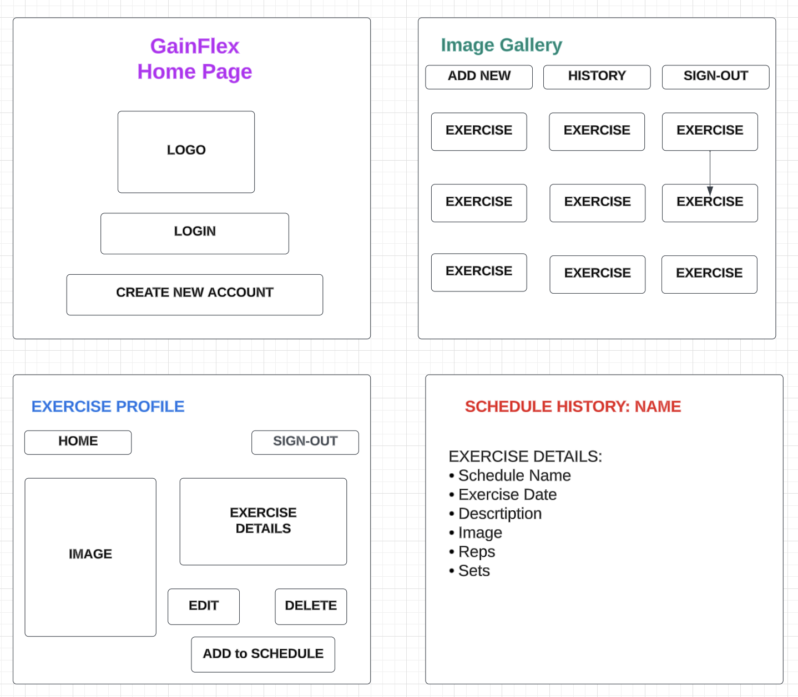
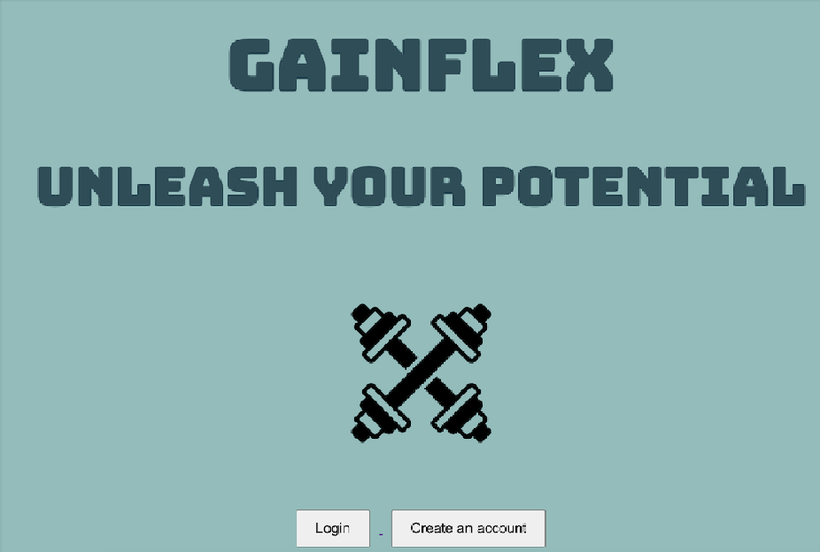
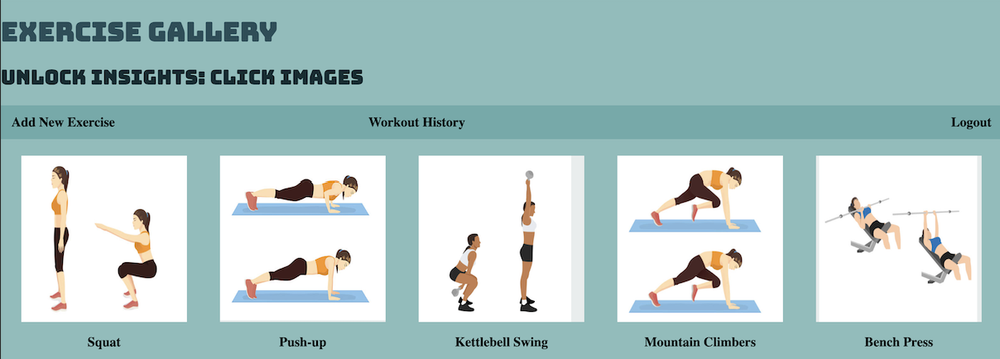
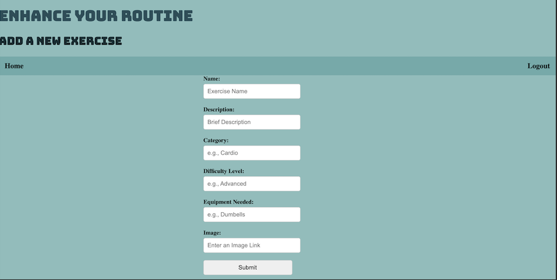
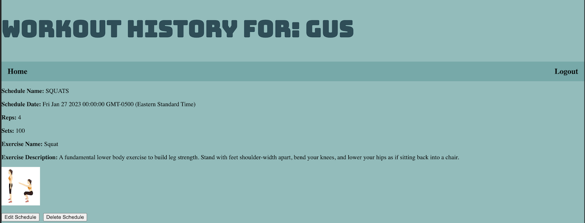

# GainFlex Tracker App

### About The Project
Welcome to   * [GainFlex](XXXXXX) - Your Ultimate Exercise Tracker!

Track your fitness journey like never before with our state-of-the-art exercise tracker app. Whether you're a seasoned athlete or just starting your fitness adventure, our app is designed to help you keep track of your workouts to help you achieve your desired level of health and wellness.

---
### Built With
- HTML5
- CSS3
- JavaScript
- jQuery
- Google Fonts 
- Node 
- Express 
- MongoDB

---
### Approach Taken 
Starting with a thorough planning phase, I defined the app's features and functionality, including user authentication, and the routes and schemas for both the exercise and schedule models. I created an initial wireframe and trello board with my tasks. 

For the backend, I chose to implement a RESTful API using a technology stack that included Node.js and Express.js. This allowed me to handle user authentication securely using JSON Web Tokens (JWT) and set up endpoints for creating, updating, and retrieving exercise data. I integrated a PostgreSQL database to store user profiles and exercise information, ensuring data integrity and efficient retrieval.

On the frontend, I utilized React.js to create a dynamic and responsive user interface. I implemented components for user registration, login, exercise logging, and progress visualization. API calls were made using asynchronous JavaScript to interact with the backend, enabling real-time data updates without requiring page refreshes.

To ensure a polished user experience, I incorporated CSS and a front-end framework for styling, maintaining a consistent design throughout the app. 

Finally, I deployed my app on Render.

---
### Initial Wireframe 

### Trello 
- As a user, I should have the ability to view a welcome screen that encourages me to either login or register.
- As an existing user, I should be able to log-in to an existing account. 
- As a new user, I should be able to sign-up for a new account. 
- As a user, I should be able to add exercises to my account. 
- As a user, I should be able to edit the exercises on my account. 
- As a user, I should be able to delete an exercise off my account. 
- As a user, I should be able to add an exercises to my workout schedule. 
- As a user, I should be able to edit my workout schedule. 
- As a user, I should be able to delete an exercise from my workout schedule. 
- As a user, I should be able to see my workout history. 

### Initial Entity Relationship Diagram (ERD)

---
### Unsolved Problems 
- The images that got populated on my exercise show route were all grabbed from my seed data, which were png image files added to my local file. However, when a user wants to add a new exercise to their account they are given an option to include an image URL. The image gets uploaded to the exercise index page, but does not sucessfully load when I open the show route for that added exercise. 

---
### GainFlex App Screenshots

---
### Links
  * [GitHub](XXXXXX)
  * [GainFlex] (DEPLOYMENT)
