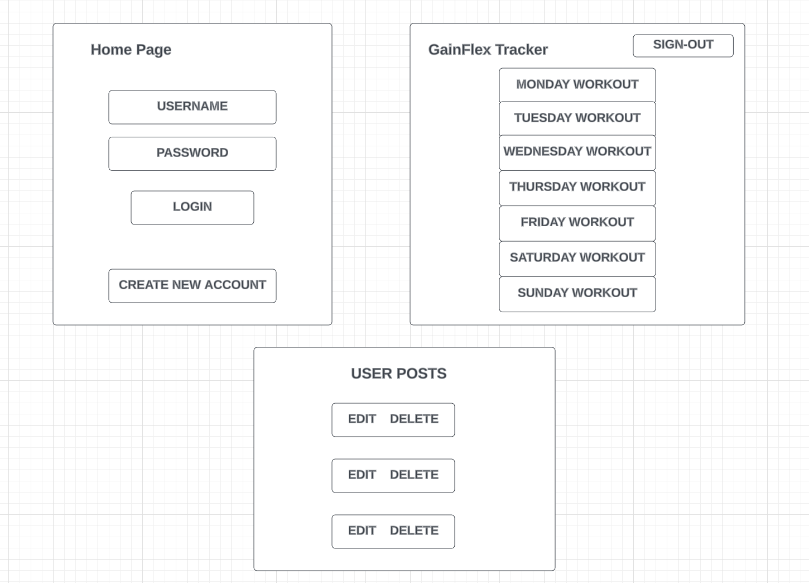
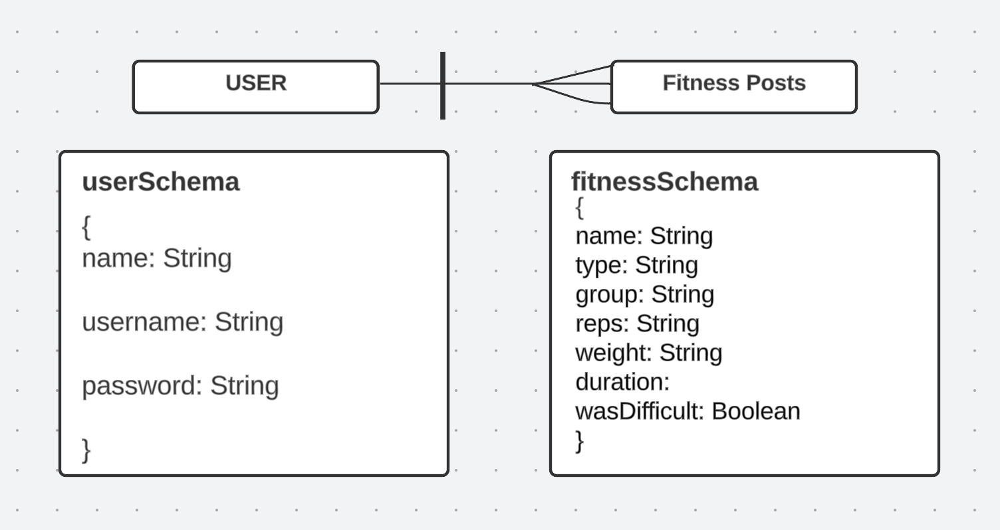

# GainFlex Tracker App

### About The Project
Welcome to GainFlex - Your Ultimate Exercise Tracker!

Track your fitness journey like never before with our state-of-the-art exercise tracker app. Whether you're a seasoned athlete or just starting your fitness adventure, our app is designed to help you set goals, stay motivated, and achieve your desired level of health and wellness.

---
### Built With
- HTML5
- CSS3
- JavaScript
- jQuery
- Google Fonts 
- Node 
- Express 
- MongoDB

---
### Approach Taken 
XXXXX

---
### Initial Wireframe 

### Trello 
- As a user, I should have the ability to view a welcome screen that encourages me to either login or register.
- As a user, I should be able to log-in to an existing account. 
- As a user, I should be able to sign-up for a new account. 
- As a user, I should be able to add exercises to my workout schedule. 
- As a user, I should be able to edit my workout schedule. 
- As a user, I should be able to delete an exercise from my workout schedule. 
- As a user, I should be able to see my workout history. 

### Initial Entity Relationship Diagram (ERD)

---
### Unsolved Problems 

---
### Links
  * [GitHub](XXXXXX)
