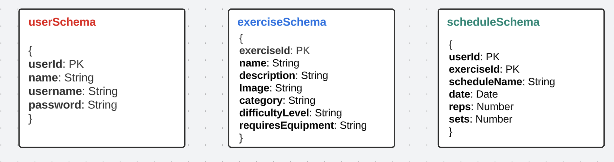

# GainFlex Tracker App

### About The Project
Welcome to *[GainFlex](https://gainflex-tracker-app.onrender.com/) - Your Ultimate Exercise Tracker!

Track your fitness journey like never before with our state-of-the-art exercise tracker app. Whether you're a seasoned athlete or just starting your fitness adventure, our app is designed to help you keep track of your workouts to help you achieve your desired level of health and wellness.

---
### Built With
- HTML5
- CSS3
- JavaScript
- jQuery
- Google Fonts 
- Node 
- Express 
- MongoDB

---
### Initial Wireframe 

### Trello 
- As a user, I should have the ability to view a welcome screen that encourages me to either login or register.
- As an existing user, I should be able to log-in to an existing account. 
- As a new user, I should be able to sign-up for a new account. 
- As a user, I should be able to add exercises to my account. 
- As a user, I should be able to edit the exercises on my account. 
- As a user, I should be able to delete an exercise off my account. 
- As a user, I should be able to add an exercises to my workout schedule. 
- As a user, I should be able to edit my workout schedule. 
- As a user, I should be able to delete an exercise from my workout schedule. 
- As a user, I should be able to see my workout history. 

### Initial Entity Relationship Diagram (ERD)

---
### Next Steps: Planned Future Enhancements 
- Video Tutorials: Integrate video tutorials demonstrating proper exercise techniques and form to ensure users perform workouts correctly.
- Reminder Notifications: Implement personalized reminder notifications to encourage users to stick to their exercise routines.
- Social Sharing: Allow users to share their exercise achievements, progress, or completed workouts on social media platforms directly from the app.
- Advanced Exercise Logging: Enable users to track specific details like workout duration, weights used, and rest periods for each exercise.
- Customizable Goals: Allow users to set and track personalized fitness goals, like weight loss, muscle gain, or specific endurance targets.

---
### GainFlex App Screenshots

---
### Links
  * [GitHub](https://github.com/Karlilz/Gains-Flex-App)
  * [GainFlex](https://gainflex-tracker-app.onrender.com/)
